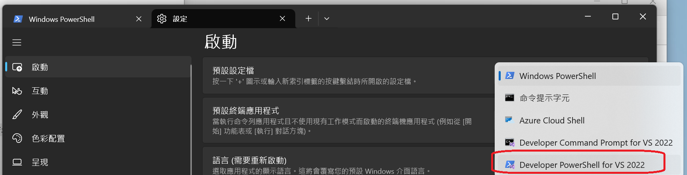

# CmakePresetExample

This project demonstrates how to set up and use `CMakePresets.json` for a modern, structured CMake workflow.

---

## 1. Create a Basic CMake Preset File

Start by creating a `CMakePresets.json` file with the minimal required structure:

```json
{
    "version": 3,
    "cmakeMinimumRequired": {
        "major": 3,
        "minor": 21,
        "patch": 0
    }
}
```

---

## 2. Add a Base Preset

Define a hidden base preset with:

- Generator set to **Ninja**
- Output directory set to `${sourceDir}/build`
- Compiler set to `cl`
- Toolchain path from `VCPKG_ROOT`

```json
{
    "version": 3,
    "cmakeMinimumRequired": {
        "major": 3,
        "minor": 21,
        "patch": 0
    },
    "configurePresets": [
        {
            "name": "base",
            "hidden": true,
            "generator": "Ninja",
            "binaryDir": "${sourceDir}/build",
            "cacheVariables": {
                "CMAKE_TOOLCHAIN_FILE": "$env{VCPKG_ROOT}/scripts/buildsystems/vcpkg.cmake",
                "CMAKE_C_COMPILER": "cl",
                "CMAKE_CXX_COMPILER": "cl"
            }
        }
    ]
}
```

---

## 3. Add Debug and Release Configure Presets

Extend the base preset to create build-type specific configurations:

```json
{
    "configurePresets": [
        {
            "name": "debug",
            "inherits": "base",
            "cacheVariables": {
                "CMAKE_BUILD_TYPE": "Debug"
            }
        },
        {
            "name": "release",
            "inherits": "base",
            "cacheVariables": {
                "CMAKE_BUILD_TYPE": "Release"
            }
        }
    ]
}
```

---

## 4. Define Build Presets

Add named build presets referencing the above configure presets:

```json
{
    "buildPresets": [
        {
            "name": "build-debug",
            "configurePreset": "debug"
        },
        {
            "name": "build-release",
            "configurePreset": "release"
        }
    ]
}
```

---

## 5. Build and Run the Project

Use the **x64 Native Tools Command Prompt for VS 2022** to open VSCode or run commands in terminal.

### Steps

1. **Configure the project**

    ```bash
    cmake --preset debug
    ```

2. **Build the project**

    ```bash
    cmake --build --preset build-debug
    ```

### Recommendation

To simplify usage in VSCode, consider setting the default terminal to **Developer PowerShell for VS 2022**:


