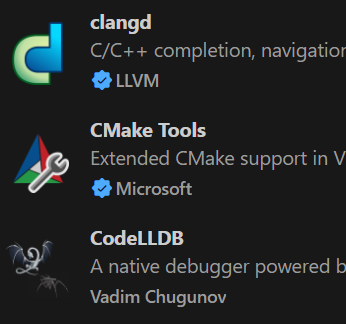
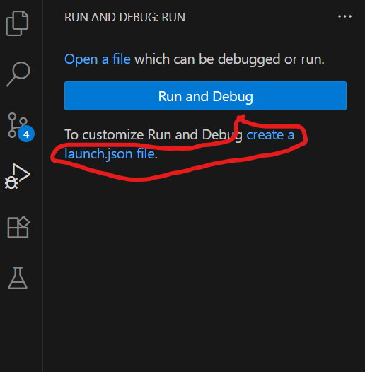
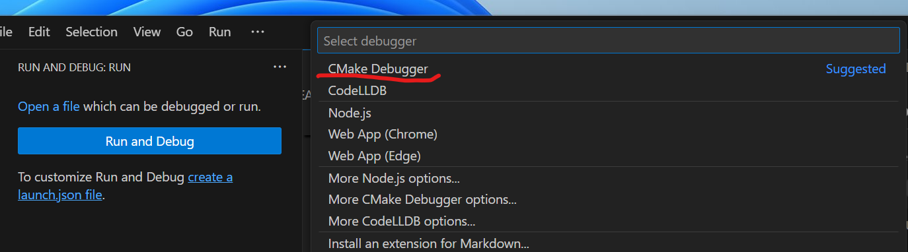
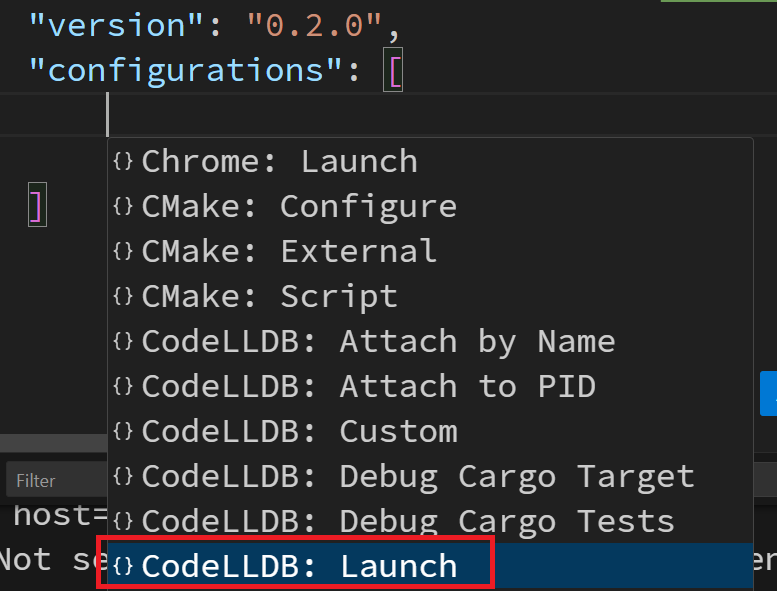

# VSCode CMake with clangd and LLDB

- **Base project:** CMakeHelloWorld
- Ensure `clangd` is already installed on your system

---

## Install Extensins

- clangd
- CMake Tools
- CodeLLDB



---

## How to Create a launch.json File

1. Open the Run and Debug panel (`Ctrl + Shift + D`)

2. Click **"create a launch.json file"**

   

3. Select **CMake Debugger**

   

4. Add **CodeLLDB Launch**

   

5. Modify the `program` path:

   From:

   ```json
   "program": "${workspaceFolder}/<program>"
   ```

   To:

   ```json
   "program": "${command:cmake.launchTargetPath}"
   ```

6. Ensure the project is built before debugging by adding:

   ```json
   "preLaunchTask": "CMake: build"
   ```

7. Start debugging with `F5`

